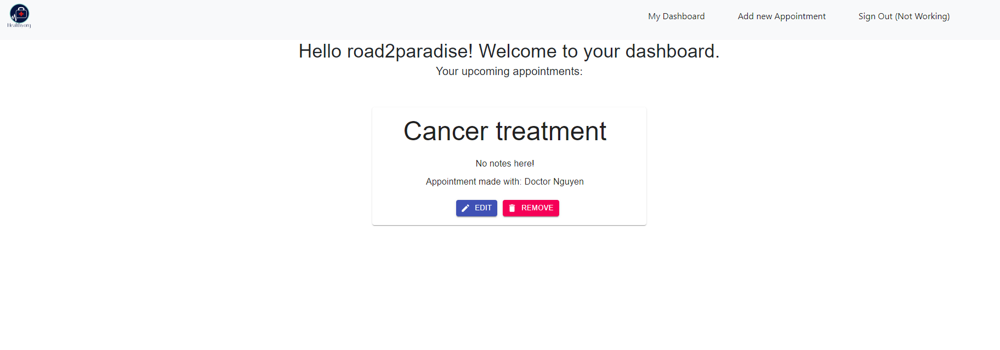

# 

# HealthyOrg Health Monitoring app

## Introduction

Created by - Kenny Nguyen for 2020 MSA - Phase 2 Assignment. This is the **front-end** repo. For the **back-end repo please see [HealthMonitorAPI](https://github.com/road2paradise/HealthMonitorAPI)**

This web-application is hosted on Microsoft Azure and can be located at the following [Link](https://)

## Basic Overview

HealthyOrg helps users keep track with their doctors appointments whether it be on-the-go (mobile) or at home (internet).

Users are able to **create** their own profile, using a standard `userName`, `email` and `password` and are able to access their own **personalised** appointments.

Users are also able to sign in and have a worry-free experience knowing that their sensitive data is protected using `JSON Web Tokens`

**Sign in**

**Register**

Users are also able to **create**, **read**, **update** , **delete** and all of their upcoming **appointments** on the UI as shown on the screenshots below.

## CRUD - Appointments

**Create a new appointment**

**Read (get) an existing appointment**

**Update an existing appointment**

**Delete an existing appointment**

## Advanced Features (Attempted)

_feelsbadman I took too long with authentication that I couldnt attempt 5_

- Custom Logo's and themeing
  I used a custom logo which I designed from scratch myself, I also used MaterialUI library and created themes for the buttons, forms etc.

  

- Authentication using JWT (See back-end Readme for back-end explanation)

Authentication is completed on the server-side. A token is sent via the server and this is saved as a cookie on the client-side, which is then sent whenever there are _sensitive_ routes / api endpoints that are protected against those who are not authorized.

An example of this in action is below, where the JWT is taken in as a cookie and sent through the authorization header. This is required when a user is trying to access their own dashboard which holds sensitive information about their treatment(s)

- Relational Databases (See back-end Readme)
- ResponsiveUI (Web + Mobile)

My web-app is able to be viewed comfortably and has a responsive UI for switching between Web and Mobile interfaces. There is a hamburger stack for Navigation tools.

